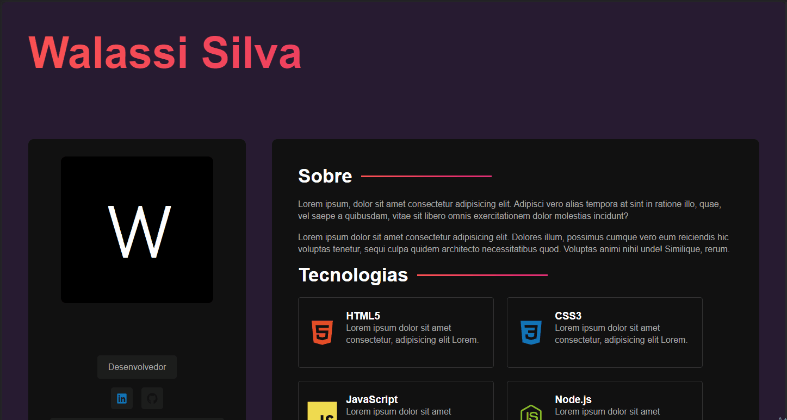

# React Currículo

Projeto desenvolvido para aprendizagem de React e Sass
[]

## Tecnologias utilizadas
- React
- Vite
- Sass

## Como utilizar
1 - Clone o projeto
```
git clone <url>
``` 
2 - Acesse a pasta do projeto
```
cd <nome do projeto>
```
## O que aprendi
- Componentizar um projeto
- O poder de usar Sass

## Onde tive dificuldade
- Estilizar a imagem de perfil de forma mais responsiva
